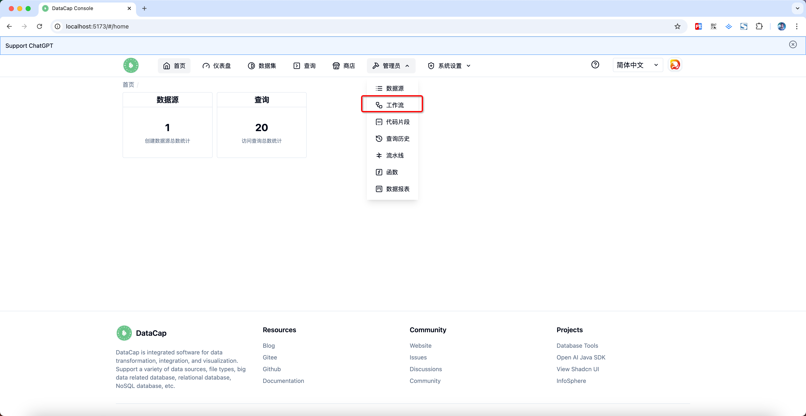
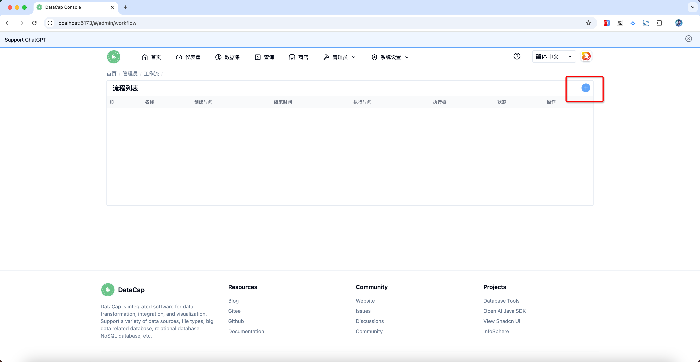
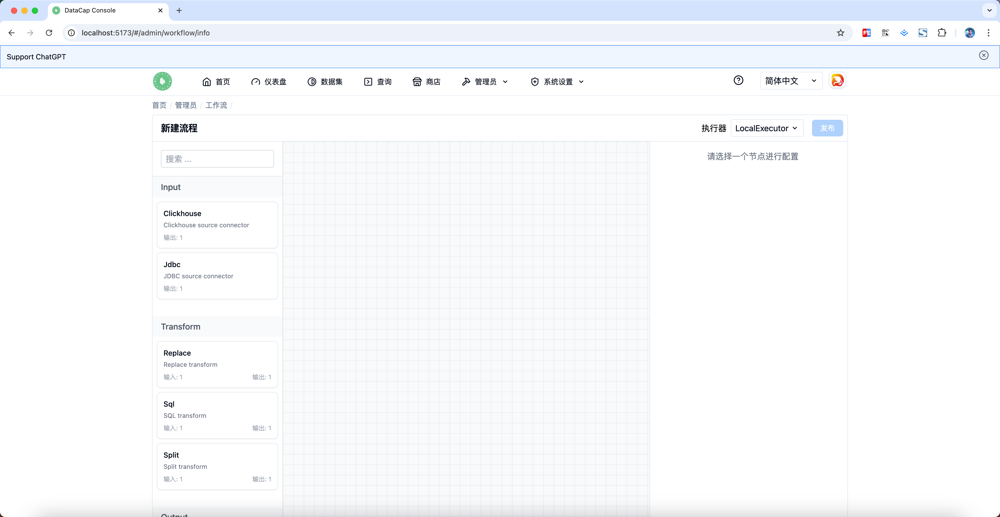
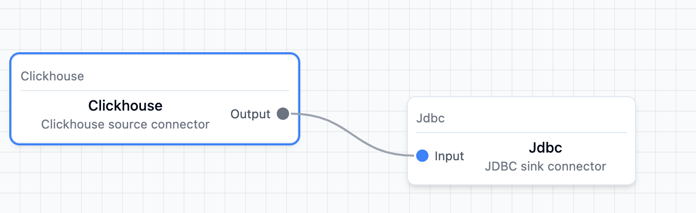
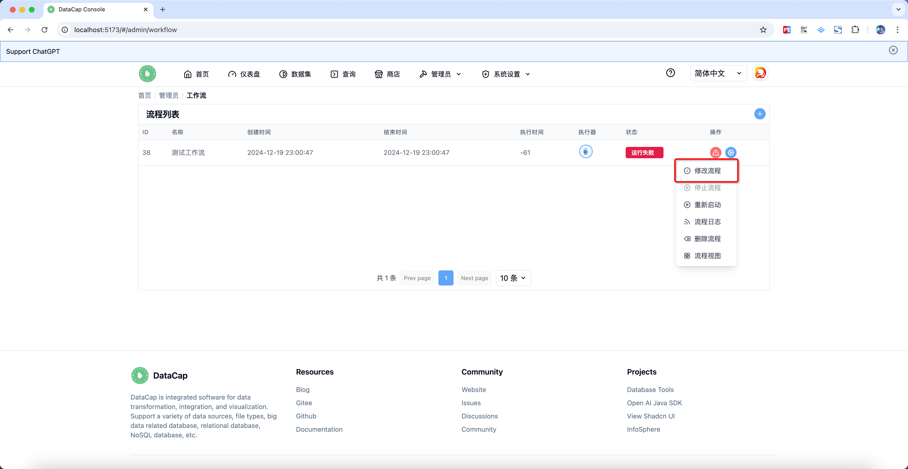

鼠标打开管理员菜单，点击 `工作流` 子菜单，跳转到工作流列表页面

点击列表展示区域的右侧添加按钮（它是一个 + 图标），点击后将弹出如下添加工作流窗口

我们通过左侧拖拽需要的节点，拖拽后系统会自动进行配置的验证，默认验证失败会出现以下页面

如果验证成功，页面如下

配置完成后，左上角 `发布` 按钮可以点击，点击后弹出配置窗口

输入流程名称点击 `提交` 按钮即可完成工作流的创建，创建完成后跳转到工作流列表页面。

### 修改工作流

在工作流列表中，我们找到需要修改的工作流对应的数据行，点击操作栏的 `设置` 图标

点击修改流程选项，即可进入修改流程页面，操作方式和新建一致。
